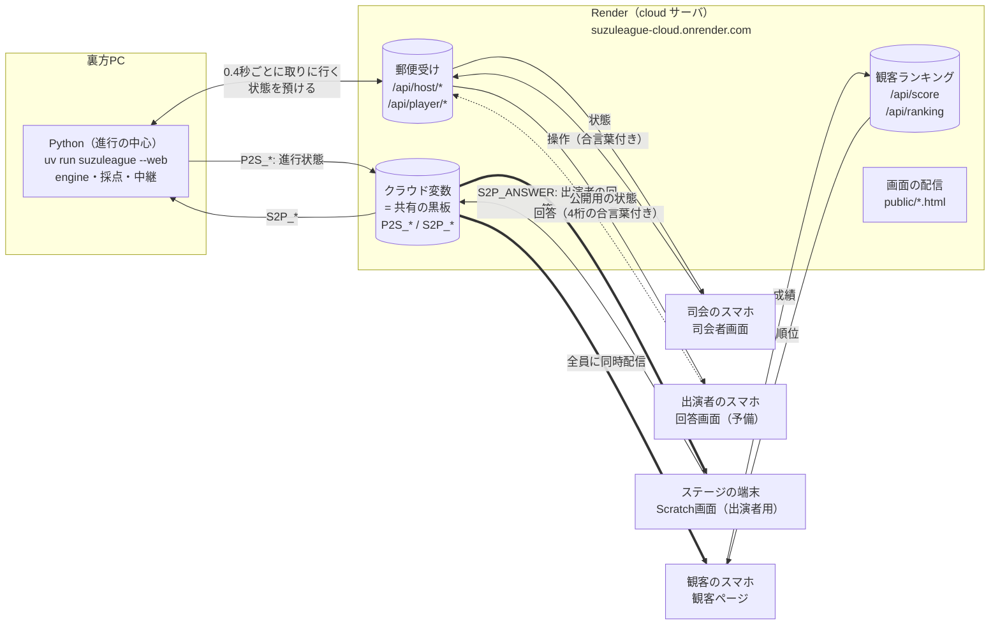
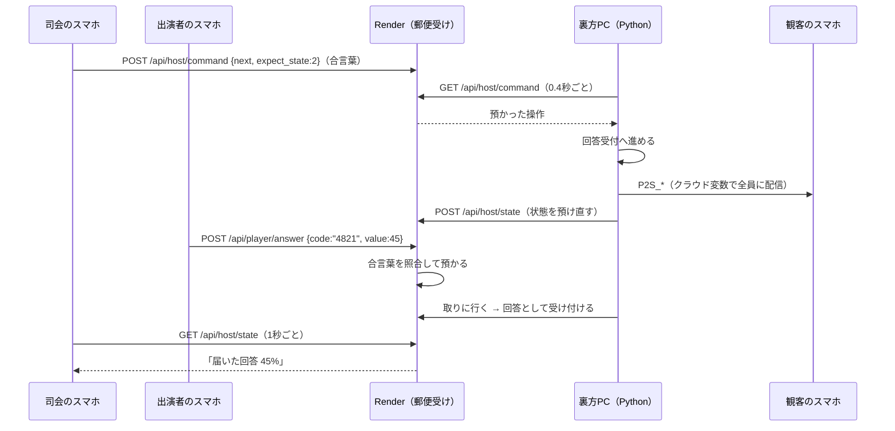
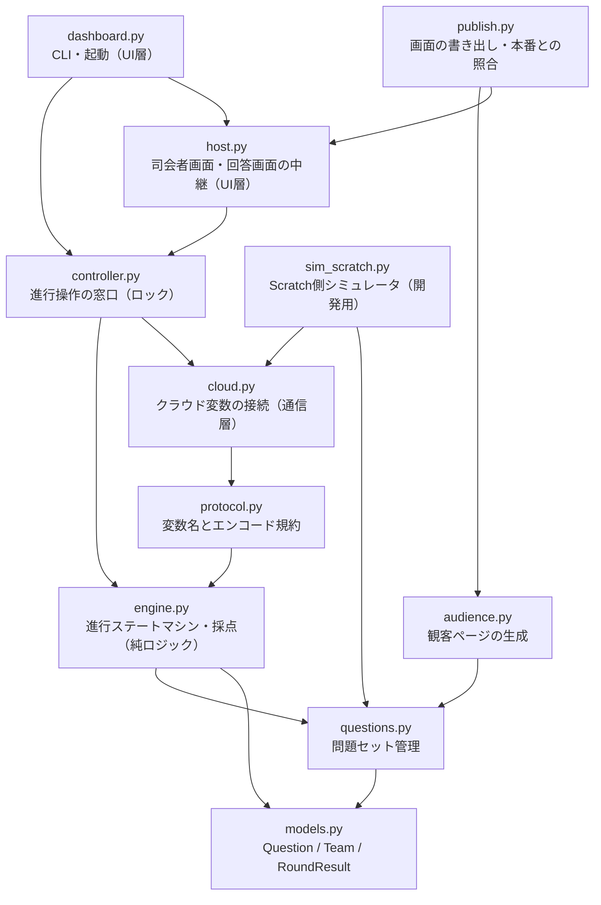
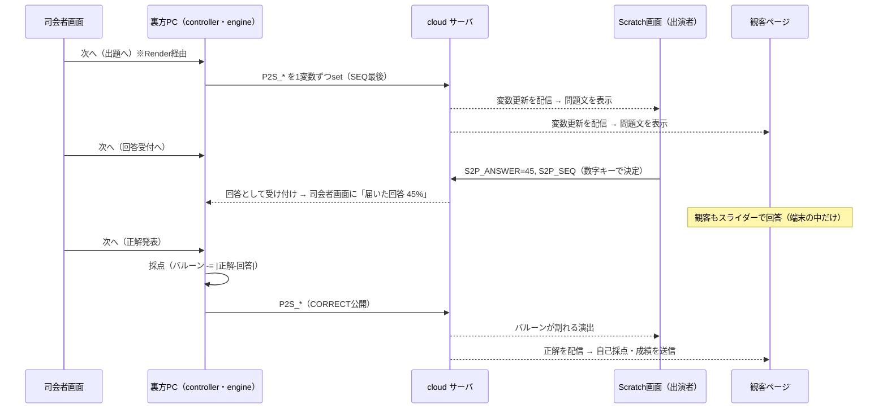

# アーキテクチャ

このドキュメントは、システム全体の構成と「なぜこの設計にしたか」を説明する。
初見の人はまずここを読めば全体像がわかる。

## このシステムは何か

高専祭ステージイベント「スズリーグ」（テレビ番組「ネプリーグ」の
「パーセントバルーン」ベースのクイズ）の進行を管理するシステム。

**プロジェクターや大画面は使わず、それぞれが手元の画面で見る**（2026-10-04決定。
企画書の「モニターはないものとしてアプリ開発を」に沿う）。司会と観客は自分のスマホ、
出演者はステージに置いた端末の Scratch 画面を使う。

| 使う人 | 画面 | 何をするか |
|---|---|---|
| 司会 | **司会者画面**（`/host.html`） | 「次へ」で進行を操作する。問題・回答・正解を確認する |
| 出演者 | **Scratch画面**（ステージに置く端末。TurboWarp で開く） | 問題を見て、数字キーで%を回答する |
| 出演者（予備） | 出演者の回答画面（`/player.html`） | Scratch の端末が使えないとき、4桁の合言葉を入れてスマホから回答する |
| 観客 | **観客ページ**（`/suzuleague.html`） | 出演者と同じ問題に答え、端末の中で自己採点する。観客ランキングに参加する |
| 裏方 | ダッシュボード（PC・ターミナル） | 進行の中心（Python）を動かしておく。予備の操作手段 |

Scratch 以外の画面は Render 上の cloud サーバ（`https://suzuleague-cloud.onrender.com`）から配信する。
誰がどの画面をどう使うかの詳細は [users.md](./users.md)。

Scratch で作ったステージ画面（Scratch担当）は、**出演者の手元の端末だけで使う**と決めた
（[#41](https://github.com/suzuka-kosen-festa/2026-suzuleague/issues/41)）。
クラウド変数での連携は実装済みで、`https://turbowarp.org/1364239598?cloud_host=wss://suzuleague-cloud.onrender.com` で開けばつながる。

イベント自体の内容（ルール・タイムテーブル・台本）は
[イベント責任者作成の企画書](./イベント責任者作成の企画書.md) を参照。

## 全体構成



- **進行の主導権は常に裏方PCのPython側**にある。どの画面もステートを自分で進めない
- **全員に配る情報**（いまの問題・正解・残りバルーン）は、これまでどおり**クラウド変数**で配る。
  クラウド変数は「名前付きの数値を置くと、接続中の全員に配信される共有黒板」 → [protocol.md](./protocol.md)
- **特定の人だけが送るもの**（司会の操作・観客の成績・予備の回答画面からの回答）は、Render の **HTTPS API** に送る。
  クラウド変数は誰でも書き込めて、書いた値が全員に流れてしまうため（合言葉を載せられない）
- 出演者の回答は、既存の Scratch 画面に合わせて**クラウド変数**（`S2P_ANSWER`）で受け取る。
  理論上は観客が書き換えられるが、文化祭の範囲では許容している（気になる場合は予備の回答画面に切り替える）
- スマホから裏方PCへは**直接つながない**。Render を郵便受けにして、裏方PCが取りに行く
  → [設計判断6](#6-スマホから裏方pcへは直接つながずrender-を郵便受けにする)

## 進行の同期

**出演者・観客・司会が、同じタイミングで次の問題に進む。**

観客ページはクラウド変数の配信を受け取るので、同期のための特別な仕組みは要らない。
司会者画面と回答画面は、裏方PCが0.4秒ごとに Render へ預け直す状態を1秒ごとに読みに行くので、
最大でも1〜2秒の遅れで揃う。

### なぜ揃うのか（クラウド変数）

クラウド変数は「**同じ部屋に繋いでいる全クライアントへのブロードキャスト**」として動く。
裏方PCが `P2S_QID`（問題の番号）を書き換えると、サーバがその瞬間に接続中の全員へ配信する。
観客のスマホ（と Scratch 画面）は、**別々に問い合わせているのではなく同じ配信を受け取っている**。

したがって、以下を満たせば観客の画面は進行と同じになる。

1. 同じ **room ID**（`SUZULEAGUE_PROJECT_ID`）に繋ぐ
2. 同じ **cloud サーバ**（`wss://suzuleague-cloud.onrender.com`）に繋ぐ
3. `P2S_SEQ` の変化を検知して他の変数を読み直す

### ずれはどのくらいか

`loadtest.py` での実測（2026-07-23、本番サーバ）:

| 接続数 | 配信到達 | 遅延(中央値) | 遅延(最大) |
|---|---|---|---|
| 100 | 99/99 | 124.0ms | 130.2ms |
| 150 | 149/149 | 113.4ms | 117.4ms |

**150クライアントに配信しても、最も速い端末と最も遅い端末の差は数ミリ秒**。
人間が知覚できる差ではない。

### 途中から参加した観客も追いつく

cloud サーバは**新規接続時に現在の変数値をまとめて送る**。
イベントの途中でQRコードを読んだ観客も、接続した瞬間に「今3チーム目の4問目」という
状態を受け取れるので、その問題から参加できる。

## 観客ページ

観客は QRコードから `https://suzuleague-cloud.onrender.com/suzuleague.html` を開く。
ログインもアプリのインストールも要らない。

### 回答は端末の中で採点し、成績だけを送る

観客の回答そのものは**サーバへ送らない**。正解発表時に届く `P2S_CORRECT` と
自分の回答の差を、その端末の中でバルーンから引く。

観客ランキングのために、正解発表のたびに**成績（20問の誤差の合計）とニックネームだけ**を
`/api/score` に送る。順位は全体結果（とチーム結果）で出す。

- **未回答の問題は1問50として数える**。発表済みの問題数は裏方PCが送る状態からサーバが数えるので、
  途中から参加した人や答えるのをやめた人が上位に残ることはない
- 成績は端末の自己申告なので改ざんは防げない。文化祭のおまけ要素と割り切っている
- 本番サーバで、300台が同時に成績を送っても全件成功した（最大2.3秒。[#32](https://github.com/suzuka-kosen-festa/2026-suzuleague/issues/32)）

観客ページは `S2P_*` に**書き込まない**。`S2P_ANSWER` は出演者の回答を入れる場所なので、
書き込むと出演者の回答として採点されてしまう。

### 大画面がないので、ステージの様子も観客ページに出す

正解発表では、自分の回答・正解に加えて**ステージ（出演者）の回答**も出す。
全体結果では、**優勝チーム・景品の案内・チームの順位・観客ランキング上位**を出す。
これらは `/api/player/state`（出演者向けの公開用の状態）から取る。

### バルーンはチームごとにリセットされる

観客のバルーンは、ステージのチームが変わるたびに100へ戻る。
出演者と同じ条件（1チーム5問・100スタート）で比べられるようにするため。
ランキングの成績（誤差の合計）はリセットせず、20問通しで数える。

## 司会者画面と出演者の回答画面（予備）



- **司会者画面**は合言葉（Render の環境変数 `HOST_TOKEN`）がないと何もできない
- **出演者の回答**は、チームごとに裏方PCが発行する**4桁の合言葉**がないと受け付けない。
  司会者画面に出るので、司会がチームの登場時に伝える。間違いが1分に30回続くと30秒止める（総当たり対策）
- 「次へ」には**表示中のステート**を添える。通信の遅れで二重に届いても2段階進まない
- 裏方PCは**起動前に溜まっていた操作を捨てる**。再起動直後に古い「次へ」が一気に流れ込まない
- 回答画面は誰でも開けるので、送る状態には**正解を発表後にしか入れない**
- Render に届かないときは、裏方PCのブラウザで同じ司会者画面を開いて操作できる（`--web` → `http://localhost:8000/host`）

### 画面の書き出し

画面の元ファイルはこのリポジトリにあり、Render へは cloud-server の `public/` として配信している。
観客ページには問題文が埋め込まれているので、**問題を差し替えたら書き出し直す**。

```bash
uv run python -m suzuleague.publish --room-id 1364239598          # 書き出し（3画面まとめて）
uv run python -m suzuleague.publish --room-id 1364239598 --check  # 本番と照合
```

手順の詳細は [development.md](./development.md#観客用ページを更新する)。
正解値は観客ページに埋め込まない（`tests/test_audience.py` で確認）。

## 主要な設計判断とその理由

### 1. 通信基盤に TurboWarp cloud を採用（本家scratch.mit.eduではなく）

| | 本家 scratch.mit.edu | TurboWarp cloud（採用） |
|---|---|---|
| 書き込みに必要なもの | Scratchアカウントでログイン（New Scratcher不可） | 不要。URLを開くだけ |
| 変数の値 | 数値のみ・256桁まで | 数値のみ・10万文字まで |
| 値の永続性 | サーバに残る | **全員切断で消える**（インメモリ） |
| レート制限 | 変数セット間隔あり | セット間隔なし・IP単位の接続制限あり |

決め手は**観客のスマホ参加**（本番スコープ）。本家だと観客全員にScratchログインを
強いることになり現実的でない。値が消える欠点は、Python側から全状態を再送する
`resync` 機能でカバーする設計にした。

### 2. 生のクラウド変数 + 自前プロトコル（scratchattachのcloud requestsではなく）

scratchattachには「cloud requests」というRPC風フレームワークもあるが、
Scratchプロジェクト側に専用テンプレートの組み込みが必要で、Scratch担当の負担が大きい。
そこで「Scratch側は変数を読む/書くだけ」で済む生変数方式にした。
変数の一覧・意味は [protocol.md](./protocol.md) に固定してある。

### 3. 問題文はID参照方式

クラウド変数は数値しか送れず、日本語テキストのエンコードは重い。
そこで**問題文マスタはPython側**（`questions.py`）に持ち、Scratchへは問題IDのみ送る。
Scratch側は行番号=問題IDのリストを持ち、`uv run python -m suzuleague.questions` で
生成した貼り付け用テキストを取り込む。問題を差し替えたら双方の更新が必要な点に注意。

### 4. ~~ダッシュボードはまずCLI~~ → 司会がスマホで操作する司会者画面に（2026-10-04）

当初は「操作するのは司会補助1人で、必要なのは次へを押すことがほぼすべて」として、
本番もCLIで進行する方針だった。デモ会で**司会自身が操作する**こと、**大画面を使わない**ことが決まり、
司会がマイクを持ったまま手元のスマホで操作できる司会者画面を作った。

ロジックと画面を最初から分けていたので、`engine.py` と `cloud.py` はほぼそのまま使えた。
CLIは予備の操作手段として残している。

### 5. 変数は1つずつ送信する（scratchattachのset_vars禁止）

scratchattachの一括送信 `set_vars()` は複数JSONを1つのWebSocketフレームに詰めるが、
TurboWarpサーバはこれを不正フレームとして無視し、**以降その接続からの送信を
すべて破棄する**（エラーは出ない。実測で確認済み）。そのため必ず `set_var()` で
1変数ずつ送る。詳細は [development.md の「既知の落とし穴」](./development.md#既知の落とし穴scratchattach--turbowarp) を参照。

### 6. スマホから裏方PCへは直接つながず、Render を郵便受けにする

司会のスマホから裏方PCへ直接つなぐ（裏方PCでWebサーバを立てる）と、
**会場Wi-Fiでスマホから裏方PCに届くかどうか**に本番の成否がかかる。
学校や会場のWi-Fiは端末どうしの通信を遮断していることが多く、事前に確かめる手段も乏しい。

そこで、どちらからも確実に届く Render を郵便受けにした。スマホは Render に操作を預け、
裏方PCは0.4秒ごとに取りに行く。裏方PCは外に出ていくだけなので、
会場Wi-Fiでもテザリングでも同じように動く。

### 7. 操作・回答・成績は HTTPS API、進行の配信はクラウド変数

クラウド変数は**誰でも書き込めて、書いた値が全員に流れる**。合言葉を載せると全員に見えてしまうし、
観客が出演者の回答を書き換えることもできてしまう。そこで「特定の人だけが送るもの」は
Render の HTTPS API に分け、合言葉はヘッダで送るようにした（他の端末には流れない）。

一方、「全員に同時に配るもの」はクラウド変数のまま。150人に配っても差は数ミリ秒で、
HTTPで全員が読みに行くより速く、サーバの負担も小さい。

### 8. 画面は cloud サーバから配信する（Vercel などに分けない）

画面・クラウド変数・APIを**同じURL**に置いているので、画面は `api/...` と書くだけでAPIを呼べ、
CORS（別ドメイン間の通信許可）の設定が要らず、デプロイも1か所で済む。

画面だけを Vercel などのCDNに分けると最初の表示は少し速くなるが、
APIとWebSocketは Render に残るので**止まりにくさは変わらない**。
リポジトリを1つにまとめる作業（[#45](https://github.com/suzuka-kosen-festa/2026-suzuleague/issues/45)）と一緒に、
デモの後で改めて考える。

## レイヤー構造

通信やUIを知らない純ロジック（engine）を中心に、依存が一方向になるよう分離している。



| モジュール | 責務 | 依存 |
|---|---|---|
| `models.py` | ドメインモデル（問題・チーム・ラウンド結果） | なし |
| `questions.py` | 問題セットのコード内管理、チームへの割り当て、Scratch貼り付け用エクスポート | models |
| `engine.py` | 進行ステートマシンと採点。**通信を一切知らない**のでオフラインでテスト可能 | models, questions |
| `protocol.py` | クラウド変数の名前と数値エンコード/デコード。通信ライブラリ非依存 | engine (Snapshot) |
| `cloud.py` | クラウド変数の接続。状態push・回答受信・resync・heartbeat・ping応答 | protocol |
| `controller.py` | 進行操作の窓口。CLI・司会者画面・Scratch・出演者の回答を**同じロックで直列化**し、操作のたびに状態を送る | engine, cloud |
| `host.py` | 司会者画面・回答画面に出す状態、操作の実行、Render 経由の中継、出演者の合言葉、予備サーバ | controller |
| `dashboard.py` | 起動とCLI。中継・予備サーバを立ち上げる | controller, host |
| `audience.py` | 観客ページの生成（問題文を埋め込む。正解は埋め込まない） | questions |
| `publish.py` | 3画面を cloud-server の `public/` に書き出す・本番と照合する | audience, host |
| `sim_scratch.py` | Scratch側のフリをする開発ツール | cloud, questions |

画面（`host.html`・`player.html`・`audience_template.html`）は外部ライブラリを使わない1ファイル完結のHTML。
cloud サーバ側のAPI（`hostApi.js`・`rankingApi.js`）は [inouekoshi/cloud-server](https://github.com/inouekoshi/cloud-server) にある。

この分離により：

- ゲームルールの変更・テストはネットワークなしで完結する（`tests/test_engine.py`）
- 司会者画面を足すときも `engine.py` / `cloud.py` はほぼそのまま使えた
- 通信仕様の変更は `protocol.py` と `docs/protocol.md` の2箇所を直せばよい

## データフロー（1ラウンドの流れ）



## 制約・リスクと対応

| 制約 | 対応 |
|---|---|
| クラウド変数は全員切断で値が消える | ダッシュボードの `resync` コマンドで全状態を再送できる |
| ~~同一IPからの接続頻度制限~~（公開サーバ実測: 連発すると1〜2分接続不可） | **解消済み**。この制限は公開サーバ前段のインフラ由来で、セルフホストには存在しない（ソースで確認） |
| 裏方PCのPythonが止まる＝進行不能 | 司会者画面に「PCの応答なし」が出る。`HEARTBEAT` 変数（15秒毎更新）でも死活を検知できる |
| ~~送信用の接続が1〜2分ごとに切られ、直後の送信が黙って消える~~（2026-10-04 E2Eで発見） | **解消済み**。送信用接続を読み続けて ping に応答する（[落とし穴6](./development.md#6-送るだけの接続は12分ごとに切られ直後の送信が黙って消える)） |
| ~~1部屋あたり128クライアントの上限~~（2026-07-22 実測） | **解消済み**。セルフホストで `MAX_CLIENTS=300` に設定。150接続まで実測確認。詳細は下記 |
| ~~Scratch からの回答が Python に届かない~~（scratchattach の受信が自前サーバを無視していた。2026-10-04 発見） | **解消済み**。受信を自前の `CloudReceiver` に置き換え（[落とし穴7](./development.md#7-scratchattach-の受信は自前サーバを指定しても公開サーバにつながる)） |
| Render が止まると全員の画面が止まる（大画面がないので、スマホが唯一の画面） | 裏方PC上でサーバを動かして Cloudflare Quick Tunnel で公開する代替手段を確認済み（[手順](./development.md#本番サーバが落ちたときの代替手段)） |

## 同時接続数の上限とセルフホスト方針

観客スマホ参加では観客の人数分だけcloudサーバへの接続が増えるため、
2026-07-22に上限を検証した（`src/suzuleague/loadtest.py`）。

TurboWarpのcloud-serverはOSS（<https://github.com/TurboWarp/cloud-server>）で、
`src/Room.js` に `maxClients = 128` とハードコードされている。同じサーバを
ローカルに立てて実測したところ、128接続までは全員に配信が届き、
140接続では128人分しか届かなかった。

**最大の注意点は、上限超過が静かに失敗すること**。WebSocketの接続自体は
成功するため、あぶれたクライアントは「繋がっているのに画面が更新されない」
状態になる。エラーはサーバログにしか出ない。

| 接続数 | 接続成功 | 配信到達 | 遅延(中央値) |
|---|---|---|---|
| 50 | 50/50 | 49/49 | 8.7ms |
| 128 | 128/128 | 127/127 | 14.0ms |
| 140 | 140/140 | **127/139** | 23.1ms |

（ローカル実測値。公開サーバ経由では遅延は約266msだった）

このため**本番はセルフホストのcloudサーバを使う方針**とする。理由:

- 128枠は観客に加えて挑戦者15人のスマホ・ステージ画面・バックエンドも消費するため、
  高専祭のステージイベントとしては余裕がない
- 公開サーバのIP単位の接続制限は、会場Wi-Fi経由だと観客が同一グローバルIPに
  集約されるため踏みやすい（この制限は cloud-server 本体ではなく公開サーバの
  前段のインフラによるもので、**セルフホストすれば存在しない**ことをソースで確認済み）
- 公開サーバはドキュメント上「ボランティア運営の無料サービス」であり、
  日時が決まったイベントの成否を預ける先として不安定

切り替えは設定だけで済む。Scratch側は URL に `?cloud_host=wss://...` を付けるだけ、
Python側は `--cloud-host` か環境変数 `SUZULEAGUE_CLOUD_HOST` で指定する
（[手順](./development.md#接続先cloudサーバの切り替え)）。**両者に同じ値を設定すること**。
片方だけ切り替えるとエラーが出ないまま互いの変数が見えなくなる。

### ホスト先: Render の無料枠（2026-07-23決定）

サーバ費用は0円で組む方針のため、Renderの無料枠にデプロイする。選定理由:

- `*.onrender.com` に管理TLS証明書が自動で付く。TurboWarpのページはHTTPSで
  配信されるため `wss://` が必須だが、**ドメインを買わずに要件を満たせる**
- cloud-serverは部屋の状態をメモリ上にのみ持つため**単一インスタンス固定が必須**だが、
  無料枠はそもそも複数インスタンスにスケールできないので設定ミスの余地がない
- 2026-02-24の仕様変更で、既存接続からのWebSocketメッセージもトラフィックとして
  数えられるようになった。本システムは15秒毎に `HEARTBEAT` を送るので
  **ダッシュボード稼働中はスピンダウンしない**

**運用上の注意**: 15分間まったく通信がないとスピンダウンする。
**17分放置して実測したところ、復帰に22.8秒かかった**（Renderの公称は約1分）。
**開演30分前にURLを開いてサーバを起こしておくこと**。

逆に、**`HEARTBEAT` を17分間送り続けた状態では応答0.43秒でスピンダウンしなかった**
（2026-07-23 実測）。イベント中はダッシュボードを起動している限り眠らない。
この前提でリリースチェックリストを組んでいる。

デプロイするサーバは [inouekoshi/cloud-server](https://github.com/inouekoshi/cloud-server)。
本家からの変更は次のとおり。クラウド変数のプロトコルには一切手を入れていない。

- 人数上限を環境変数 `MAX_CLIENTS` で指定できるようにした
- `render.yaml` を追加した
- 画面（`public/`）と、司会者画面・回答画面・観客ランキングのAPI（`src/hostApi.js`・`src/rankingApi.js`）を足した（2026-10-04）

**本番の接続先**（2026-07-23 デプロイ済み）:

| 項目 | 値 |
|---|---|
| URL | `wss://suzuleague-cloud.onrender.com` |
| リージョン | Singapore（日本から最短） |
| プラン | free（インスタンス数1） |
| `MAX_CLIENTS` | 300 |
| `HOST_TOKEN` | 司会者画面の合言葉（管理画面で設定。リポジトリには置かない） |
| サービスID | `srv-d9go9isvikkc739qi500` |

Scratch側は `https://turbowarp.org/<プロジェクトID>?cloud_host=wss://suzuleague-cloud.onrender.com`
で開く。Python側は `SUZULEAGUE_CLOUD_HOST` に同じURLを設定する。

#### 本番サーバでの実測（2026-07-23）

| 接続数 | 接続成功 | 配信到達 | 遅延(中央値) |
|---|---|---|---|
| 100 | 100/100 | 99/99 | 124.0ms |
| 150 | 150/150 | 149/149 | 113.4ms |
| 300 | 227/300 | 測定不能 | ─ |

**150接続までは全員に配信が届くことを確認済み**。遅延は約120msで、
公開サーバ経由（約266ms）より速い。Singaporeリージョンを選んだ効果。

300接続の失敗は**測定した側（Mac 1台）の限界**であってサーバの限界ではない。
失敗理由はDNS解決エラー（`nodename nor servname provided`）と接続タイムアウトで、
サーバのログには `Too many clients` も含めエラーが一切出ていない。
`loadtest.py` は1接続ずつ順に繋ぐため1台から大量に繋ぐと詰まる。
本番は観客それぞれの端末が並行して接続するので、この制約は当てはまらない。

不調時のバックアップとして、裏方PC上でcloud-serverを動かして
Cloudflare Quick Tunnel（無料・アカウント不要）で公開する手順を用意してある。
**2026-07-23に実地で確認済み**（観客ページの配信・cloud変数の読み書き・20接続の配信到達）。
ただし同時200リクエストの上限があるため観客参加には余裕がなく、あくまで代替。
手順は [development.md](./development.md#本番サーバが落ちたときの代替手段)。

なお公開サーバへの負荷検証はTurboWarpの利用方針（botは1接続まで、
接続の高速な開閉は禁止）に反するため行っていない。`loadtest.py` にも
公開サーバへ多数接続しようとすると停止するガードを入れてある。

## 残っていること

進捗と残りのタスクは [status.md](./status.md) にまとめている。
