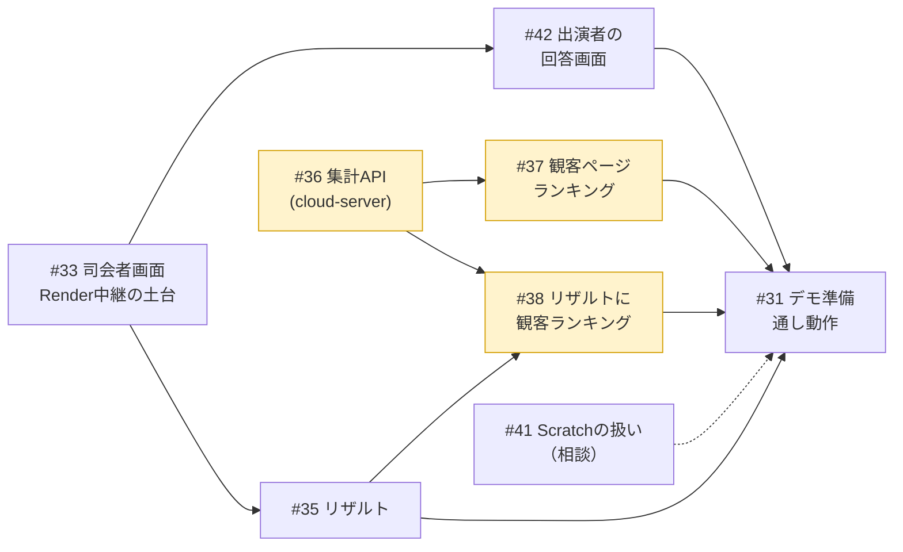

# 進捗状況（2026-10-04 時点）

このドキュメントは**今どこまで進んでいて、次に何をすべきか**を1枚で把握するためのもの。
設計の説明は [architecture.md](./architecture.md)、開発手順は [development.md](./development.md)、
**誰がどの画面を使うか**は [users.md](./users.md) を参照。

課題の全量と最新状況は
[GitHub Issues](https://github.com/suzuka-kosen-festa/2026-suzuleague/issues)
と[マイルストーン](https://github.com/suzuka-kosen-festa/2026-suzuleague/milestones)
で管理している。このドキュメントは節目ごとの棚卸しとして更新する。

技術的な背景を知らない人には
[しくみの図解](https://htmlpreview.github.io/?https://github.com/suzuka-kosen-festa/2026-suzuleague/blob/main/docs/explainer.html)
（[docs/explainer.html](./explainer.html)）を先に渡すとよい。

## スケジュール

| マイルストーン | 期日 | 中身 |
|---|---|---|
| [M1 10/7デモ](https://github.com/suzuka-kosen-festa/2026-suzuleague/milestone/2) | **10/7（水）** | デモ会で指摘された画面をそろえて見せる |
| [M2 デモの指摘を反映](https://github.com/suzuka-kosen-festa/2026-suzuleague/milestone/3) | 10/17 | 指摘への対応・観客ランキングの負荷検証 |
| [M3 会場リハーサル](https://github.com/suzuka-kosen-festa/2026-suzuleague/milestone/4) | 10/24目安（日程未定） | 会場Wi-Fi・実機スマホ（観客・出演者・司会）で確認 |
| [M4 本番](https://github.com/suzuka-kosen-festa/2026-suzuleague/milestone/5) | 10/31（土）〜11/1（日） | **10/28にコード凍結**。以降は設定とデータの差し替えだけ |

イベント時間は40分、準備10分。参加者は4チーム・計15人。

当初の「8月末完成」は、Scratch側の実装を待つ形になって守れなかった。マイルストーンは閉じてある。

## 今の状況

**ゲームの進行そのものは動く。** 10月上旬のScratch担当とイベント担当の会議で、ゲームの進行は問題なく終わったと報告があった。Scratchプロジェクト内のログにも、Pythonから送った状態を受け取った記録が残っている。

一方、**デモ会で「足りない画面」が5つ指摘された。** 原因は、使う人（司会・出演者・観客）を整理しないまま画面を作っていたこと。整理し直した結果は [users.md](./users.md) にまとめた。

### 大きな方針変更：全員が自分のスマホで見る（2026-10-04）

**プロジェクターや大画面は使わない。** 司会・出演者・観客の全員が、自分のスマホで画面を見る。出演者の回答もスマホから行う。
これまでの「Scratchのステージ画面をプロジェクターに映す」前提が崩れたため、**Scratch画面の使い方は Scratch担当と相談して決める**（[#41](https://github.com/suzuka-kosen-festa/2026-suzuleague/issues/41)）。
10/7デモには、どちらに転んでも使う部分から作る。

| 指摘 | 判定 | 対応 |
|---|---|---|
| 視聴者参加画面 | ✅ 実装済み（デモで見せていなかった） | <https://suzuleague-cloud.onrender.com/suzuleague.html>。QRとスマホ実機確認は [#31](https://github.com/suzuka-kosen-festa/2026-suzuleague/issues/31) |
| スマホ用のUI | △ **全画面をスマホ前提にする**ことになった | 観客ページは対応済み。新しく作る画面もすべてスマホ縦画面で作る |
| 司会者画面 | ❌ 未着手（CLIのみ） | [#33](https://github.com/suzuka-kosen-festa/2026-suzuleague/issues/33)。司会がスマホで操作する。台本（カンペ）は出さない（[#34](https://github.com/suzuka-kosen-festa/2026-suzuleague/issues/34) はクローズ） |
| リザルト画面（優勝者に景品の案内） | ❌ 未着手 | [#35](https://github.com/suzuka-kosen-festa/2026-suzuleague/issues/35)・観客ランキング表示 [#38](https://github.com/suzuka-kosen-festa/2026-suzuleague/issues/38)。全員のスマホに出す |
| ランキング機能（観客の中での順位） | ❌ 未着手 | 集計API [#36](https://github.com/suzuka-kosen-festa/2026-suzuleague/issues/36)・観客ページ側 [#37](https://github.com/suzuka-kosen-festa/2026-suzuleague/issues/37) |
| （方針変更で追加）出演者の回答画面 | ❌ 未着手 | [#42](https://github.com/suzuka-kosen-festa/2026-suzuleague/issues/42) |

```
バックエンド中核（進行・採点・通信）  ████████████████████ 完了
通信基盤（セルフホストサーバ）        ████████████████████ 完了・稼働中
ゲームルール・本番問題データ          ████████████████████ 完了
Scratch側との結合                     ████████████████░░░░ 結合は完了。スマホ方針での使い方が未定（#41）
観客ページ（スマホ）                  ████████████████░░░░ 実装済み・実機確認とランキングが残る
司会者画面（スマホ）                  ░░░░░░░░░░░░░░░░░░░░ 未着手（M1）
出演者の回答画面（スマホ）            ░░░░░░░░░░░░░░░░░░░░ 未着手（M1）
リザルト（スマホ）                    ░░░░░░░░░░░░░░░░░░░░ 未着手（M1）
当日の運営体制                        ████████░░░░░░░░░░░░ 司会が操作すると決定・リハ日程が未定
```

## M1：10/7デモまでのタスク

作業はほぼバックエンド担当が一人で行う。**目安の合計は約3.5日で、残り3日を超えている。** 時間が足りなくなったら、P1の観客ランキングはデモでは画面イメージだけにする。
司会者画面・出演者の回答画面・リザルトを優先するのは、これがないと進行そのものが回らないため。

| Issue | 内容 | 優先 | 目安 |
|---|---|---|---|
| [#41](https://github.com/suzuka-kosen-festa/2026-suzuleague/issues/41) | Scratch画面の使い方をScratch担当と相談 | P0 | 相談のみ |
| [#33](https://github.com/suzuka-kosen-festa/2026-suzuleague/issues/33) | 司会者画面：スマホで進行を操作（Render中継の土台） | P0 | 1日 |
| [#42](https://github.com/suzuka-kosen-festa/2026-suzuleague/issues/42) | 出演者の回答画面：スマホで%を回答 | P0 | 0.5日 |
| [#35](https://github.com/suzuka-kosen-festa/2026-suzuleague/issues/35) | リザルト：チーム順位・優勝・景品の案内 | P0 | 0.5日 |
| [#36](https://github.com/suzuka-kosen-festa/2026-suzuleague/issues/36) | 観客ランキング：cloud-serverに集計API | P1 | 0.5日 |
| [#37](https://github.com/suzuka-kosen-festa/2026-suzuleague/issues/37) | 観客ランキング：ニックネーム・成績送信・自分の順位 | P1 | 0.5日 |
| [#38](https://github.com/suzuka-kosen-festa/2026-suzuleague/issues/38) | リザルトに観客ランキング上位 | P1 | 0.2日 |
| [#31](https://github.com/suzuka-kosen-festa/2026-suzuleague/issues/31) | デモ準備：QR発行・スマホ実機確認・通し動作 | P0 | 0.3日 |



（黄色は P1。時間が足りなければデモでは省く）

### 作り方の要点

- **依存は増やさない**。新機能も標準ライブラリで作る
- **すべての画面をスマホ縦画面で作り、Render の cloud-server から配信する**
- **進行の中心（Python）は裏方のPC1台で動かす。** スマホからこのPCへは直接つながない（会場Wi-Fiで届く保証がない）。**Render を郵便受けにして中継**する
  - 全員に配る状態（進行・問題・正解など）: これまでどおりクラウド変数（`P2S_*`）
  - 特定の人だけが送るもの（司会の操作・出演者の回答・観客の成績）: Render の HTTPS API。Python は短い間隔で取りに行って実行し、結果を預け直す
  - 合言葉は HTTPS のヘッダで送るので、クラウド変数と違って他の端末には流れない
  - 司会者画面は合言葉、出演者の回答画面はチームごとに発行する4桁の合言葉で守る（観客のなりすまし対策）
  - Render に届かないときに備え、司会者画面は裏方PC上（`uv run suzuleague --web` → `http://localhost:8000/host`）でも開けるようにする
- **観客ランキングのスコア** = 20問の誤差の合計（少ないほど上位。未回答は誤差50）。端末の自己申告なので改ざんは防げない。文化祭のおまけ要素と割り切る。ニックネームは cloud-server にある NGワードフィルタで検査する

## M2以降

| マイルストーン | Issue | 内容 |
|---|---|---|
| M2 | [#32](https://github.com/suzuka-kosen-festa/2026-suzuleague/issues/32) | 観客ランキングの負荷検証（150台の同時送信） |
| M2 | [#39](https://github.com/suzuka-kosen-festa/2026-suzuleague/issues/39) | 不適切なニックネームを司会者画面から非表示にする |
| M3 | [#21](https://github.com/suzuka-kosen-festa/2026-suzuleague/issues/21) | リハーサルの日程（司会者画面は司会が操作する、と決定済み） |

## 完了していること

### バックエンドの中核

| モジュール | 状態 |
|---|---|
| `engine.py` 進行ステートマシン・採点 | ✅ 9ステート実装。通信非依存でテスト可能 |
| `protocol.py` クラウド変数の規約 | ✅ P2S 7変数 + S2P 3変数を定義 |
| `cloud.py` cloud接続 | ✅ 状態push・回答受信・resync・heartbeat |
| `dashboard.py` 司会用CLI | ✅ next/answer/status/teams/resync |
| `questions.py` 問題セット | ✅ 本番問題20問（アンケート2種の集計結果） |
| `sim_scratch.py` Scratch側シミュレータ | ✅ Scratch実装なしでE2E検証できる |
| `teams.py` チーム構成 | ✅ 名前・メンバー・登場順をJSONで差し替え可能（個人情報はリポジトリに置かない） |
| `audience.py` 観客用ページ | ✅ 生成・デプロイ済み（端末内で自己採点する方式） |
| `loadtest.py` 負荷検証 | ✅ 接続数と配信到達率・遅延を実測できる |
| テスト | ✅ 66件パス（ネットワーク不要・0.2秒） |

### Scratch側との結合

本番プロジェクト [`1364239598`](https://scratch.mit.edu/projects/1364239598/)（2026-10-03更新）の中身を Scratch API で確認した（2026-10-04）。

- クラウド変数10個を実装済み。P2S 7変数・`S2P_SEQ`・`S2P_ANSWER`・`HEARTBEAT`
- `S2P_ACK` だけ未実装。Python側はログに出すだけなので、進行には影響しない
- 表示用リスト `問題文` 20件が `questions.py` と全件一致（[#5](https://github.com/suzuka-kosen-festa/2026-suzuleague/issues/5) クローズ）
- Scratch側の対応ステートは 1〜6。8（全体結果）の画面はない
- **大画面を使わない方針になったため、今後の使い方は Scratch担当と相談する**（#41）

### 通信基盤

- 本番の接続先: **`wss://suzuleague-cloud.onrender.com`**（Render無料枠・Singapore・`MAX_CLIENTS=300`）。費用は0円
- 150接続まで全員に配信が届くことを実測済み（遅延約120ms）
- **無料枠の残量は 2026-10-04 時点で 0.08 / 750時間**。既存の2サービスはほとんど時間を使っておらず、10/31に枠切れで止まる心配はない（[#16](https://github.com/suzuka-kosen-festa/2026-suzuleague/issues/16) クローズ）
- サーバ停止時の代替手段（裏方PC上で動かして Cloudflare Quick Tunnel で公開）は実地で確認済み

詳細は [architecture.md](./architecture.md#同時接続数の上限とセルフホスト方針)。

### 確定したルール・方針

- **ぴったり賞は不採用**（2026-07-23）。本番では `--perfect-bonus` を付けない
- **誰が何問目を答えるかは司会がその場で決める**（2026-07-24）。システムは回答者を管理しない
- **サーバ費用は0円で組む**（2026-07-23）
- **本番まで依存を更新しない**（2026-07-23）。新機能も標準ライブラリで作る
- **プロジェクター・大画面は使わず、全員が自分のスマホで見る**（2026-10-04）。出演者もスマホで回答する。司会者画面は司会がスマホで操作する。台本は紙で持ち、システムでは出さない
- **観客ランキングを作る**（2026-10 デモ会）。これに伴い「観客の回答はサーバへ送らない」方針を改め、成績だけを送る形にした（[#7](https://github.com/suzuka-kosen-festa/2026-suzuleague/issues/7) を引き継いでクローズ）

## 未解決の論点

| 論点 | 状況 |
|---|---|
| Scratch画面の使い方 | 大画面なしの方針で前提が変わった。Scratch担当と相談する（#41） |
| リハーサルの日程 | 企画書で未記入。会場Wi-Fiは会場でしか確かめられない（#21） |
| 観客ランキングの上位に景品を出すか | 今は出さない前提。出すなら、自己申告のスコアでは不正を防げないので作り直しが要る |

## リスク

| リスク | 影響 | 対応 |
|---|---|---|
| **10/7まで3日しかなく、目安の合計は約3.5日** | デモで画面がそろわない | P0（司会者画面・出演者の回答画面・リザルト）を先に仕上げ、P1（観客ランキング）は最後に回す |
| Render が落ちる・届かない | **全員の画面が止まる**（大画面がないので、スマホが唯一の画面） | 代替手段（裏方PC上でサーバを動かし Cloudflare Quick Tunnel で公開）は確認済み。司会者画面は裏方PC上でも開けるようにする |
| 観客のニックネームに不適切な語 | 全員のスマホのリザルトに出る | NGワードフィルタで弾く。すり抜けたものは司会者画面から隠す（#39） |
| 観客が出演者になりすまして回答する | 出演者の得点が狂う | チームごとに発行する4桁の合言葉がないと回答できないようにする（#42） |
| 正解の出る司会者画面を観客に見られる | 答えが漏れる | 正解は押したときだけ表示する |
| 司会者画面のURLが漏れて、他人に進行を操作される | 進行が乗っ取られる | 合言葉がないと操作できないようにする。合言葉はRenderの環境変数と裏方PCにだけ置く |
| Render に届かない（司会の操作だけ） | スマホから操作できない | 裏方PC上の同じ画面で操作を続ける（CLIも残す） |
| 会場ネットワークの品質 | 観客参加・ランキングが成立しない | 会場でのリハーサル（M3）で確認する |
| cloud サーバの単一障害点 | サーバが落ちると進行が止まる | 代替手段は確認済み（[手順](./development.md#本番サーバが落ちたときの代替手段)）。ランキングのデータはサーバ再起動で消えるが、イベント中は HEARTBEAT で起きている |
| Render 無料枠のスピンダウン（17分放置で復帰に22.8秒） | 開演直後にサーバが応答しない | **開演30分前に必ず起こす**。HEARTBEATを送り続けている間は眠らないことを実測済み |
| 観客数が `MAX_CLIENTS` を超える | 超過分の観客が静かに脱落する | 300に設定済み。150までは実測で確認 |

## 運用ルール

- 技術的な詰まり・仕様変更は **Discord で即時相談**する
- 通信仕様を変えたら `protocol.py` と `docs/protocol.md` を同時に更新し、
  **Scratch担当に必ず連絡**する（[手順](./development.md#通信仕様を変更するとき)）
- 問題を差し替えたら、`questions.py`・Scratchの `問題文` リスト・観客ページ（再生成とデプロイ）の**3か所を同時に更新**する
- 本番投入前の確認事項は
  [リリースチェックリスト](./development.md#リリース本番投入チェックリスト) を参照
